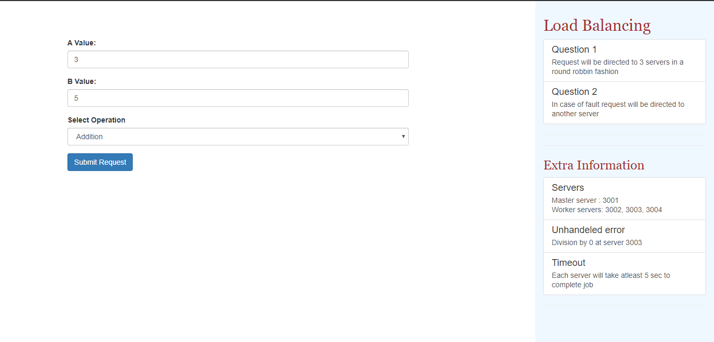
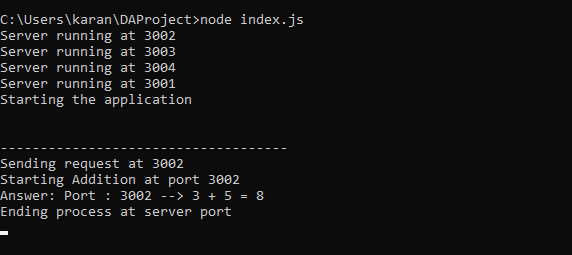
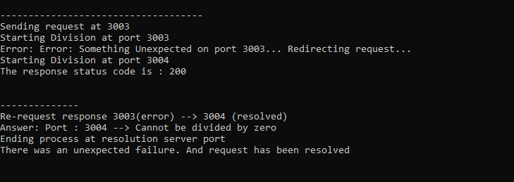

# Load Balance

**Load Balance** distributes the request load from the client among three worker server routing the request through a main server. It also ensures fault tolerance by reinitiating job on other server.

It uses express framework of node.js and simple http request

## Getting Started

These instructions will get you a copy of the project up and running on your local machine for development and testing purposes.

### Prerequisites

You need to install node in your system. Download it from [here](https://nodejs.org/en/download/).

### Installing

A step by step series of examples that tell you how to get  the web application running

Clone the repo and enter inside the directory

```shell
$ git clone https://github.com/chevlikaran/LoadBalance.git 
$ cd LoadBalance
```

Install all npm modules

```shell
$ npm install
```

Run the node app

```shell
$ node index.js
```

The app should be up and running at [localhost:3001](http://localhost:3001/)

### How to use
Follow the following steps to use the app :
1. Request
   - Enter integer value for variable A & B
   - Select a function (Addition, Subtraction, Division, Multiplication)
   - Send request
2. Generate error
   - After first request second request will go to server 3003
   - Choose value of B as 0
   - Select the Division function
   - Request will throw a 404 error and will further be handled by the subsequent server

### Screen shots

#### User Interface  


#### Load Balancing
Normal processing of request on server 3002             


#### Fault Tolerance
Fault occured at 3003 and reuqest reinitiated at 3004


### Built With

* HTML
* CSS/bootstrap
* NodeJs

## Contributors

* **Karan Chevli** - U16CO112 
* **Jashwanth Reddy** - U16CO073
* **Vivek Shah** - 
* **Rimal Parikh** - 
